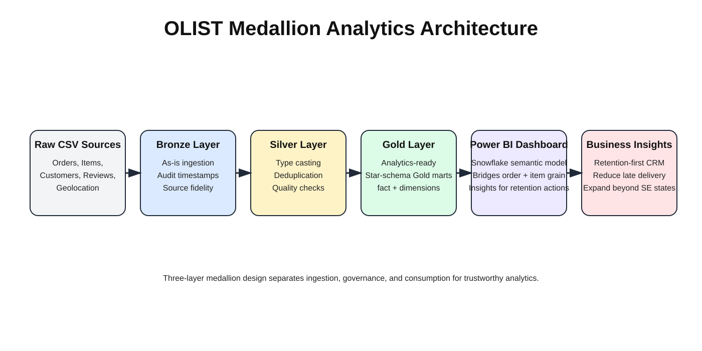

# Olist Marketplace Analytics and Experimentation Platform

End-to-end analytics engineering and product analytics project built on the Brazilian Olist marketplace dataset.

This project transforms raw transactional data into a governed analytics warehouse and executive dashboard to diagnose marketplace maturity, retention gaps, and operational friction.

It demonstrates production-style thinking across:
- Medallion data modeling
- Data quality governance
- Customer lifecycle analytics
- Experimentation design
- Executive BI delivery

---

## Executive KPI Snapshot

- **Total Revenue:** R$13.59M
- **Total Orders:** 99K
- **Unique Customers:** 96K
- **Repeat Purchase Rate:** 3.1 percent
- **Average Order Value:** R$136.7
- **Average Review Score:** 4.09
- **Fulfillment Success Rate:** 97.3 percent

**Key signal:** Marketplace shows strong acquisition but weak retention.

---

## Business Context

Olist experienced rapid growth followed by early signs of marketplace maturity. Revenue expanded sharply during 2017 but growth momentum slowed in 2018, indicating the business is transitioning from hyper-growth toward a more mature phase.

Customer behavior is heavily skewed toward one-time purchases. Delivery performance shows a strong relationship with customer satisfaction. Revenue and customer activity remain concentrated in a few southeastern states.

**Strategic question:** How can Olist re-accelerate growth while improving customer lifetime value?

---

## Data Architecture (Medallion Model)

The project follows a three-layer medallion architecture to separate raw ingestion, data quality processing, and analytics consumption.

### Data Flow

Raw CSVs
→ Bronze Layer
→ Silver Layer
→ Gold Layer
→ Power BI Dashboard
→ Product and Growth Insights

### Bronze Layer

**Goal:** Preserve source fidelity.

**Key features:**
- Loads CSVs as-is
- Minimal assumptions
- Audit timestamps added
- Handles messy source quirks

**Notable challenge:** Empty strings in numeric columns broke CAST operations. Type conversion was intentionally deferred to the Silver layer to maintain raw data integrity.

### Silver Layer

**Focus:** Cleaning, standardization, and data quality enforcement.

**Transformations include:**
- Type casting and null handling
- Text normalization
- Portuguese-to-English category mapping
- Deterministic deduplication
- Geolocation standardization

**Advanced fixes:**
- Used `ROW_NUMBER` to resolve duplicate review IDs across orders
- Mode-based geolocation deduplication reduced about one million rows to roughly nineteen thousand unique ZIP codes

### Gold Layer

Analytics-ready curated data model at the order grain in database.

**Current modeling approach:** Gold is currently maintained as a star-schema-style analytical layer centered on `fact_orders` with reusable business dimensions. The focus is stable KPIs, reliable joins, and clean handoff into Power BI.

**Fact table**
- `fact_orders`

**Dimension tables**
- `dim_customers`
- `dim_products`
- `dim_sellers`
- `dim_date`

**Engineering highlights:**
- Pre-aggregated payment and item metrics
- Primary key constraints enforced
- Delivery SLA metrics precomputed
- BI-optimized joins
- RFM segmentation outputs and A/B test summary outputs were generated in Python and written back into Gold via SQLAlchemy for downstream BI consumption

**Critical bug avoided:** A cartesian product inflated payments eight to twelve times and was fixed using pre-aggregation CTEs.

---

## Engineering Highlights

- Built full medallion warehouse from raw ingestion to analytics consumption
- Implemented multi-layer validation checks
- Prevented multi-table aggregation inflation
- Designed BI-optimized Gold tables for executive analytics
- Debugged complex Power BI filter propagation
- Applied statistical testing for product experimentation
- Documented real-world data quality incidents

---

## Strategic Analytical Tracks

### Marketplace Health Diagnostics

Growth analysis shows 2017 experienced roughly 6.5 times year-over-year growth while monthly growth in 2018 slowed to about 0 to 3 percent, indicating early maturity.

Geographic analysis shows SP, RJ, and MG contribute about 64.5 percent of customers and revenue, suggesting both saturation risk and whitespace opportunities.

Delivery performance analysis shows even small delays sharply reduce customer satisfaction. On-time deliveries maintain strong ratings while late deliveries show steep increases in negative reviews.

### RFM Customer Segmentation

Customers are classified using recency, frequency, and monetary scoring.

Repeat buyers represent about 3 percent of the customer base but generate roughly 1.9 times higher lifetime value than one-time buyers. Retention is the largest monetization opportunity.

### A/B Test Simulation

Controlled simulation evaluates a ten percent second-purchase coupon.

- **Control rate:** 2.95 percent
- **Treatment rate:** 4.09 percent
- **Absolute lift:** 1.14 percentage points
- **Relative lift:** 38.6 percent
- **P value:** less than 0.001

**Decision:** Statistically significant. Recommend rollout subject to cost validation.

### Experimentation Note

This experiment is **simulation-based** and was analyzed using a **two-proportion z-test** to compare conversion rates between control and treatment groups. In production, this framework should be run on **actual campaign data** collected from a live randomized experiment before final business rollout decisions are made.

---

## Executive Dashboard

The Power BI model was strengthened through multiple debugging cycles.

**Crucial semantic model choices:**
- Started from Gold fact/dimension tables and kept relationships focused on metric correctness and filter behavior
- Used `order_items` as a bridge table in Power BI so order-grain and item-grain analysis both remained accurate
- Loaded `order_items` from the Silver layer specifically for item-level analysis
- Injected Python-generated `rfm` and `ab_test_summary` tables back into the Gold database through SQLAlchemy before loading to Power BI
- Kept `ab_test_summary` intentionally standalone (no relationships) as an insight summary table, not a filter-propagating model table

**Power BI outputs (what we do and what we find):**
- Monitor marketplace health trends and identify where growth is slowing
- Compare first-time vs repeat behavior to surface retention gaps
- Track delivery experience vs review outcomes to isolate service-quality drivers
- Evaluate experiment outcomes to support evidence-based product decisions

**Major issues solved:**
- Fixed filter propagation between Orders and Order Items
- Resolved denominator mismatches in customer metrics
- Diagnosed `TREATAS` over-filtering
- Corrected scatter plot aggregation grain
- Improved visual density and layout

These improvements strengthened metric integrity and stakeholder trust.

---

## Core Business Insights

- Marketplace acquisition is strong but retention is critically low
- Delivery performance is the highest-impact customer experience lever
- Growth is geographically concentrated and nearing saturation
- Category mix is diversified with no single dominant segment
- Repeat customers represent the highest ROI growth lever

---

## Technical Best Practices Demonstrated

- Defensive SQL using `COALESCE`, `NULLIF`, and `CASE`
- Structured CTE-based aggregation
- Referential integrity validation
- Layer-wise row count auditing
- Documentation-driven development

---

## Future Enhancements

- Cohort retention curves
- Customer lifetime value decomposition
- Seller-level delay diagnostics
- Real campaign experiment tracking
- Item-grain fact modeling

---

## Tech Stack

- **SQL:** MySQL 8
- **Python:** Pandas, NumPy, SciPy
- **BI:** Power BI
- **Modeling:** Star-schema-style Gold analytics layer
- **Architecture:** Medallion

---

## How to Run

### SQL pipeline order

1. `01_bronze_schema.sql`
2. `01_bronze_validation.sql`
3. `02_silver_schema.sql`
4. `02_silver_validation.sql`
5. `03_gold scripts`
6. `04_analytical_queries.sql`

### Python notebooks

- `rfm_customer_segmentation.ipynb`
- `AB testing.ipynb`

### Dashboard

Open and refresh `dashboard/OLIST_customer_analysis.pbix`.

---

## Dataset

Brazilian E-Commerce Public Dataset by Olist on Kaggle.
[🔗 Dataset Link](https://www.kaggle.com/datasets/olistbr/brazilian-ecommerce)

---

## Author

Ria Singh
