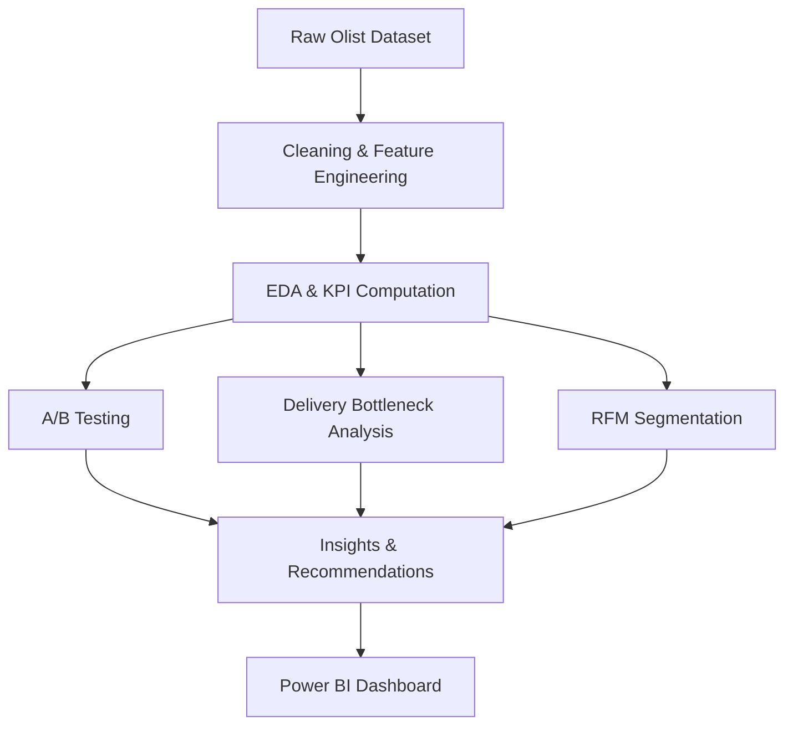

# Olist Marketplace Data Analysis & Insights

## Project Overview

This project analyzes the Olist Brazilian eCommerce dataset to identify delivery bottlenecks, evaluate customer value, and run A/B testing experiments. The goal is to support Olist in improving conversion rates, delivery reliability, and customer retention through data-driven insights and Power BI dashboards.
## Overview
This repository analyzes the Olist Brazilian eCommerce dataset to uncover delivery bottlenecks, quantify customer value, and evaluate payment-method impacts on order value. Outputs include exploratory notebooks, A/B testing, RFM segmentation, and a Power BI dashboard aimed at improving delivery reliability, conversion, and retention.

---
## Business Objective
Enable Olist to reduce delivery delays, improve conversion, and grow customer lifetime value through data-driven operational and marketing decisions.

## Problem Statement

Olist, a Brazilian e-commerce marketplace, has received concerns from sellers regarding delayed deliveries and declining customer conversion rates. The company aims to:

- Identify friction points in the purchase-to-delivery pipeline
- Assess the impact of payment methods on customer spending
- Segment customers based on value for targeted loyalty strategies

---

## Tasks & Business Objectives

### Task 1: A/B Testing — Payment Method vs Order Value

**Objective:**  
Determine whether customers using Credit Cards (Group A) spend more than those using Boleto/Voucher (Group B).

- **Metric Used:** Average payment value
- **Test Used:** Independent T-Test
- **Insight:** Statistically significant difference found — credit card users spend more, indicating better targeting potential for upsell.

---

### Task 2: Delivery Bottleneck Analysis + Top Performers

**Objective:**  
Find bottlenecks in the order-to-delivery pipeline and highlight top-performing sellers and product categories.

**Key Metrics:**
- **Avg. Delivery Duration**
- **Approval to Shipment Lag**
- **Delayed Delivery Rate**
- **Revenue per Seller**


**Deliverable:**  
Interactive Power BI dashboard with KPIs, insightful charts, and executive summary.

---

### Task 3: Customer Segmentation & Value Analysis

**Objective:**  
Identify the most valuable customers using Total Spend, Order Frequency, and Recency.

#### Metrics:
- **Total Spend** = Price + Freight or Payment Value
- **Order Frequency** = # of Orders per Customer
- **Recency = Days since last purchase

#### Method:
- Applied RFM Scoring (Recency, Frequency, Monetary) using quantiles
- Classified customers into groups:
  - **Top Customers**
  - **Loyal Customers**
  - **Recent Buyers**
  - **Frequent Buyers**
  - **At Risk**

**Deliverable:**  
Visualized RFM segments and generated business recommendations for retention and loyalty programs.

---

## Dataset Used

Brazilian E-Commerce Public Dataset by Olist, available on Kaggle  
[🔗 Dataset Link](https://www.kaggle.com/datasets/olistbr/brazilian-ecommerce)

---
Olist faces seller concerns about delayed deliveries and declining conversion rates. The business needs to:
- Identify friction points in the order-to-delivery pipeline.
- Understand how payment methods influence order value.
- Segment customers to target retention and loyalty programs.

## Business Case
Delivery delays degrade customer trust and increase churn. By quantifying delay drivers, Olist can prioritize logistics fixes that protect revenue. Payment-method insights inform targeted incentives that increase average order value, while RFM-based segmentation focuses retention resources on the most valuable and at-risk customers.

## How It Works
1. **Data Ingestion & Cleaning**: Load Olist tables, normalize timestamps, and engineer delivery and customer metrics.
2. **Exploratory Analysis**: Identify distributions, outliers, and operational trends.
3. **A/B Testing**: Compare order values between credit card and boleto/voucher users.
4. **Delivery Bottleneck Diagnostics**: Measure approval-to-shipment lag, delivery duration, and delay rates.
5. **RFM Segmentation**: Score customers by recency, frequency, and monetary value.
6. **Visualization**: Summarize findings in a Power BI dashboard.

## Workflow


## Steps to Run
1. **Clone the repository**.
2. **Open notebooks** in order:
   - `notebooks/EDA and AB Testing.ipynb`
   - `notebooks/Delivery Bottleneck.ipynb`
   - `notebooks/RFM.ipynb`
3. **Refresh the Power BI dashboard** in `dashboards/ecom_dashboard.pbix`.

## Project Structure
```
.
├── dashboards/
│   └── ecom_dashboard.pbix
├── notebooks/
│   ├── Delivery Bottleneck.ipynb
│   ├── EDA and AB Testing.ipynb
│   └── RFM.ipynb
└── README.md
```

## Dataset
Brazilian E-Commerce Public Dataset by Olist (Kaggle):
https://www.kaggle.com/datasets/olistbr/brazilian-ecommerce

## Tools & Technologies

- **Python** (Pandas, NumPy, Matplotlib, Seaborn)
- **Power BI** (KPI Cards, Bar Charts, Line Charts, Scorecards)
- **A/B Testing** (T-tests)
- **Customer Segmentation** (RFM Analysis)

---
- Python (Pandas, NumPy, Matplotlib, Seaborn)
- Power BI (KPI Cards, Bar Charts, Line Charts, Scorecards)
- A/B Testing (T-tests)
- Customer Segmentation (RFM Analysis)

## Key Business Insights

- Credit Card users spend ~20% more on average than Boleto/Voucher users.
- Average delivery time is 11.4 days, with a noticeable 7.7% delay rate. Increase focus on last-mile logistics to reduce delays.
- Big Spenders & Recent Buyers account for the majority of revenue and are critical segment for loyalty efforts.
- At-Risk customers form a sizeable share, representing a retention opportunity.

---

## Visual Highlights

Power BI dashboard includes:
  - Delivery metrics across seller, state, and category
  - Top performing sellers and categories
  - Dynamic filters for segmenting customer insights
  - Clean KPI cards for executive-level reporting

- Credit card users spend ~20% more on average than boleto/voucher users, suggesting a strong upsell opportunity.
- Average delivery time is ~11.4 days with a ~7.7% delay rate, highlighting last-mile logistics as a key improvement area.
- High-spend and recent buyers generate a large revenue share and should be prioritized for loyalty programs.
- At-risk customers represent a clear retention opportunity with targeted outreach.

## Conclusion
The analysis reveals clear levers to improve delivery performance and revenue: optimize shipment timelines, tailor incentives by payment method, and focus retention strategies on high-value and at-risk segments.

## Improvements & Future Scope
- **Carrier performance modeling** to predict and prevent late deliveries.
- **Cohort and LTV analysis** to improve retention budgeting and long-term ROI.
- **Experimentation roadmap** for shipping and pricing tests with measurable uplift.
- **Real-time monitoring** in Power BI to track delay spikes and service-level compliance.

